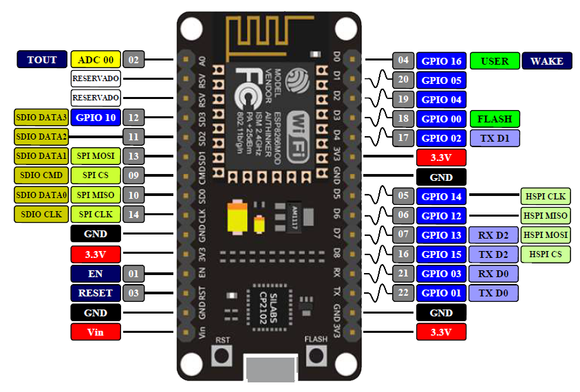
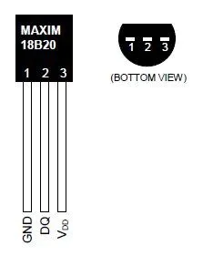
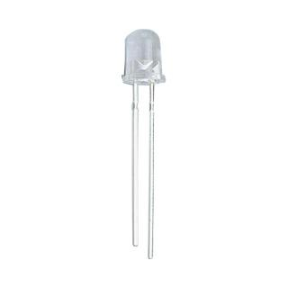

# ESP8266(NodeMCU) Arduino 红外空调自动控制, 专治冬天上班起不来床

## 功能

- 工作日（周一到周五）早上 6:40，当气温低于 15°C，自动开启空调，把房间捂热，温度 26 度，风力中等。早上 7:40, 空调自动关闭。
- 支持通过 WebUI 查看当前时间和气温。可以手动控制空调开关。

WebUI 打开方式：与 esp8266 连接到同一个 wifi，浏览器访问 http://my-ac。

我的是**海尔中央空调**，如需控制其他品牌空调，请修改头文件

```cpp
#include <ir_Haier.h> // 此处是海尔空调，可以根据自己空调型号自行更换
```

下面这行代码决定使用的空调控制协议，要使用其他型号，将`IRHaierACYRW02`更换成其他类即可。一种品牌可能有多种协议，如果控制失败，可以换一种协议再试试。

```cpp
IRHaierACYRW02 airCond(IR_PIN)
```

[IRremoteESP8266](https://github.com/crankyoldgit/IRremoteESP8266) 库中已经内置多种空调控制协议，比如格力、美的等，详情参见[这里](https://github.com/crankyoldgit/IRremoteESP8266/blob/master/SupportedProtocols.md)

## 材料

- ESP8266(NodeMCU) 1 个
  
- DS18B20 温度传感器 1 个
  
- 5mm 950nm 波长 红外发光二极管 1 颗
  
- 上拉电阻 R1(4.7KΩ)，用于上拉温度传感器输出 PIN
- 分压电阻 R2(阻值根据红外二极管额定电压选择), 用于给红外二极管分压

## 需要的 Arduino 库

- DallasTemperature - 温度监测
- NTPClient - 网络时间获取
- IRremoteESP8266 - 红外控制，内置多种空调控制协议

## 接线

**红外二极管**

ESP8266 D1 --- 分压电阻 R2 --- 红外二极管 正极
ESP8266 GND --- 红外二极管 负极

**温度传感器**

ESP8266 3.3V --- 上拉电阻 R1 --- DS18B20 DQ --- ESP8266 D2
ESP8266 3.3V --- DS18B20 VDD
ESP8266 GND --- DS18B20 GND
